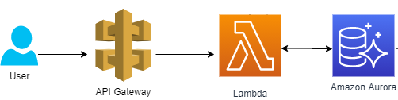

# DevOps Test
This an API example.

## Technologies involved
This code is based on [python-serverless-api](https://github.com/techjacker/python-serverless-api).
Technologies involved are:
- [Flask](https://flask.palletsprojects.com/en/1.0.x/)
- [Flask SQLAlchemy](https://flask-sqlalchemy.palletsprojects.com/en/2.x/)

This code can be deployed to AWS easily by using [terraform](https://www.terraform.io/)


## Infrastructure
This deployment uses:
- AWS API Gateway
- AWS Lambda
- AWS Aurora PostgreSQL Serverless



## Setup

#### 1. Create `.env` file and update contents
This is used to set the environment variables required for deployment and local development.
```
$ cp .env.example .env
$ vim .env
```

#### 2. Create a virtualenv then install requirements:
```
$ make env
$ source env/bin/activate
$ make deps
```

## Example Usage

#### 1. Set Environment
Ensure you have created your virtualenv and have the necessary environment variables set (see [setup instructions](#setup) above).
```
$ source env/bin/activate
$ source .env
```

#### 2. Run server

##### On host
```
$ make server-debug
```

##### In docker
```
$ docker-compose up
```

#### 3. Manually test development server
```
$ http-prompt localhost:5000
GET /hello/whatever
```

## Run tests
Run the following command:
```
make test
make lint
```

## Deploy to AWS

#### 1. Set AWS credentials
Export `AWS_ACCESS_KEY_ID`, `AWS_DEFAULT_REGION` and `AWS_SECRET_ACCESS_KEY` variables.

#### 2. Create tfstate bucket
```
cd terraform/init
terraform init
terraform apply
```

#### 3. Generate bundle and deploy
Then run the following command:
```
./bin/deploy
```


